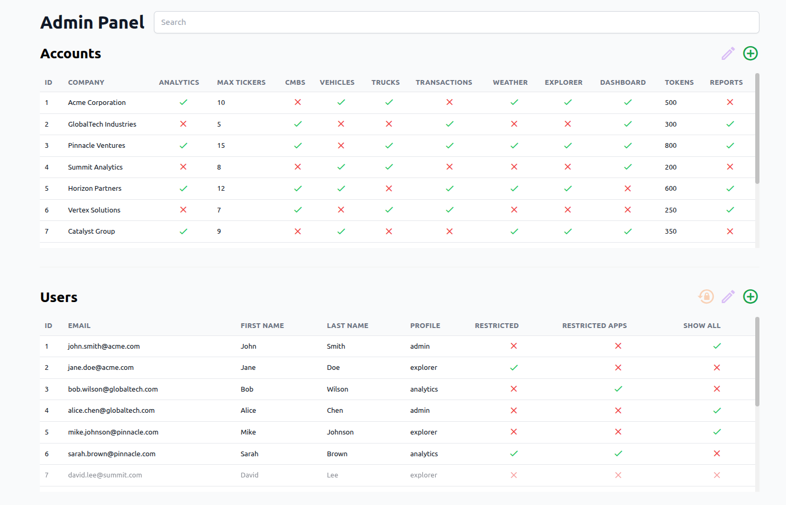
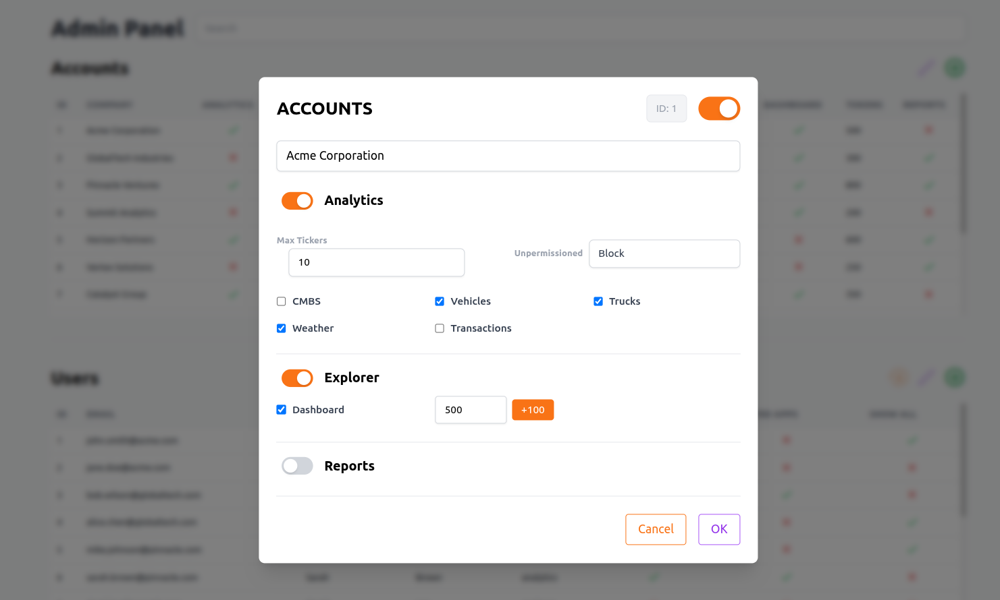
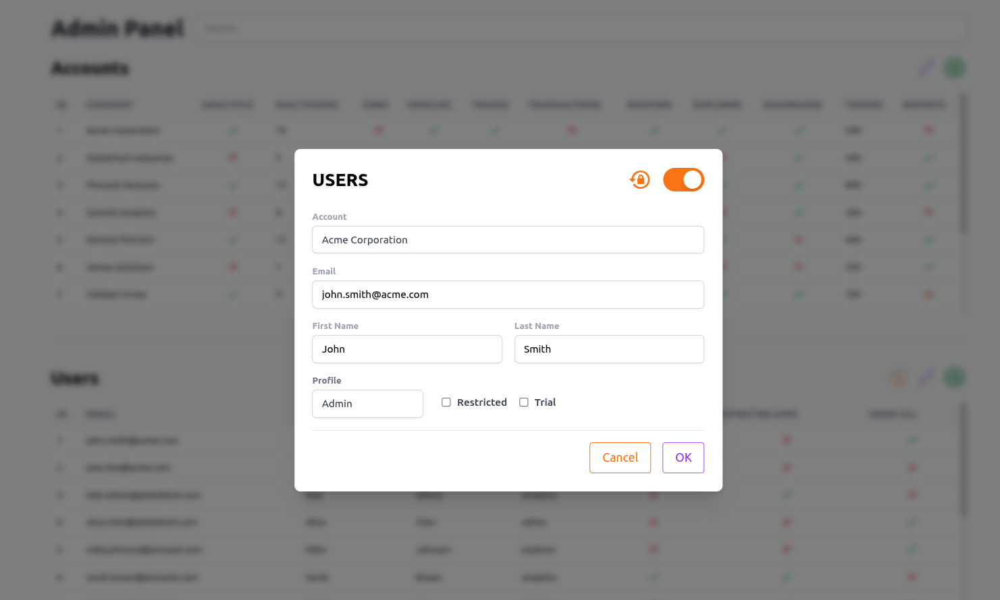
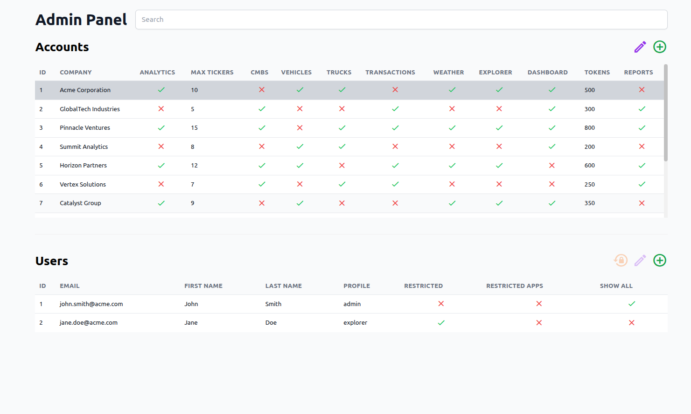
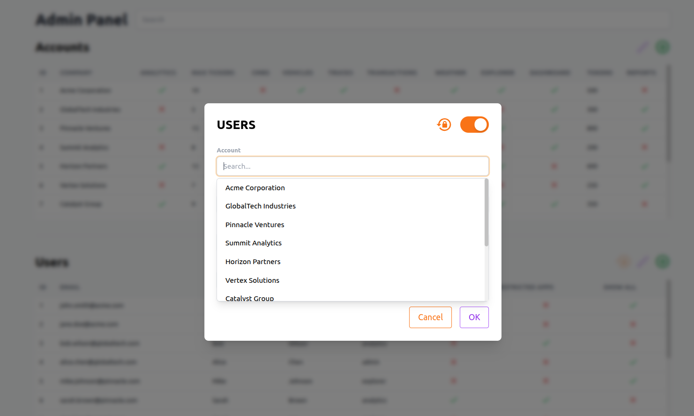
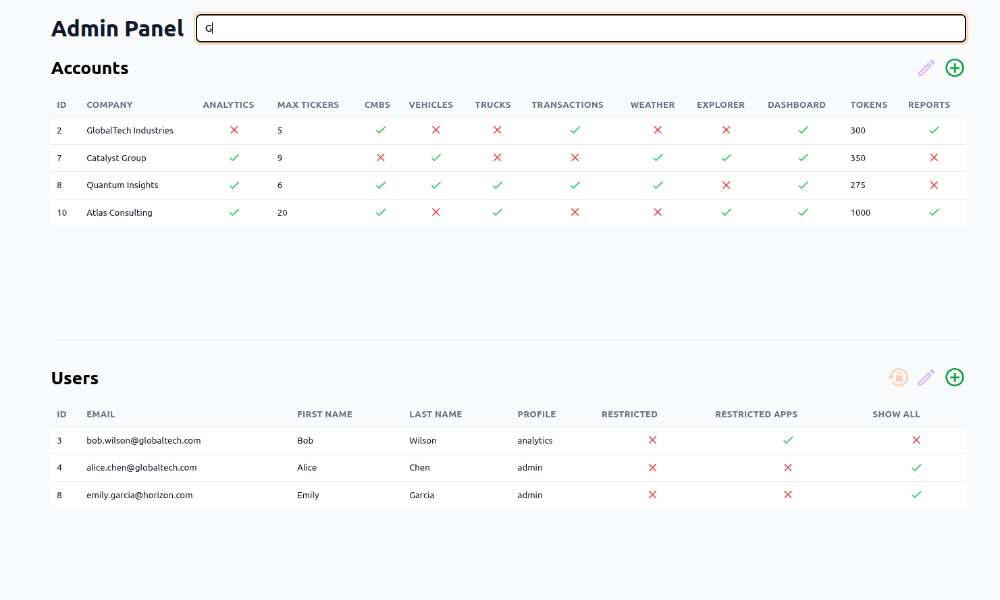
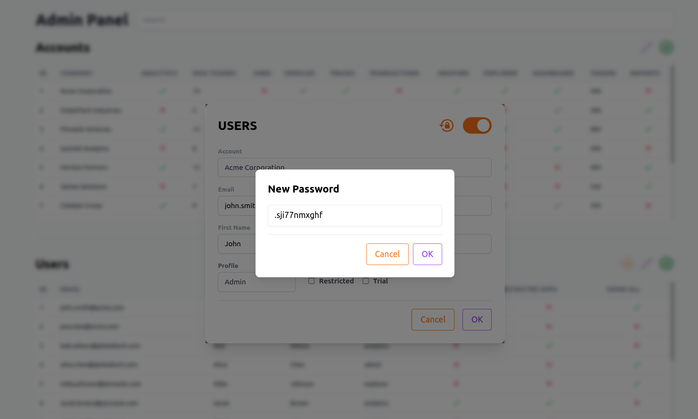

# Admin Panel – Frontend Example



This project is a **frontend Admin Panel** built as part of a real internal tool.
It showcases UI, state management, forms, tables, and user interactions.

## Demo Mode

This project includes a **demo mode** that allows it to run standalone with mock data, no backend required.

To enable demo mode, import the API module and call `enableDemoMode()`:

```javascript
import api from './src/api.js';

// Enable demo mode - uses static TSV files from data/ directory
api.enableDemoMode();

// Or specify a custom data path
api.enableDemoMode('path/to/data/');
```

In demo mode:
- GET requests are served from static `.tsv` files in the `data/` directory
- POST requests are no-ops (logged to console but not sent)
- All UI interactions work normally


## 📷 Screenshots

### Accounts Management
This screenshot shows the Accounts table and how accounts are displayed in the panel.



### Users Management
This screenshot shows the Users table and associated users in the panel.



### Accounts → Users selection
Selecting an account automatically filters the related users.



### User Form – Account selection
This screenshot shows how a user can change the associated account in the form.



### Global Search
This screenshot shows the search bar that filters both Accounts and Users in the panel.



### Password Reset
Clicking the "Regenerate Password" button opens a modal where a new password is generated.



## ✨ Features

- Accounts and Users management
- Data tables with filtering and search
- Create / edit forms
- Modal dialogs
- Custom dropdowns and toggles
- Password reset flow (UI)
- Reusable components
- Unit tests for core components


## Getting Started

### Prerequisites
- Node.js 18+
- npm or yarn

### Installation

```bash
# Install dependencies
npm install

# Start development server
npm run dev

# Build for production
npm run build

# Run tests
npm test
```

The app will start at `http://localhost:5173` with demo mode enabled by default.


## Project Structure

```
admin-panel/
├── admin/              # Vue components
│   ├── AdminPanel.vue     # Main container
│   ├── AccountsTable.vue  # Accounts list with CRUD
│   ├── UsersTable.vue     # Users list with CRUD
│   ├── AccountForm.vue    # Account create/edit modal
│   ├── UserForm.vue       # User create/edit modal
│   ├── DataTable.vue      # Reusable data table
│   ├── DropDown.vue       # Select dropdown
│   ├── SearchableDropDown.vue
│   └── Toggle.vue         # Boolean toggle
├── data/               # Mock data (TSV files)
│   ├── accounts.tsv
│   └── users.tsv
├── src/                # Core modules
│   ├── api.js             # HTTP client with demo mode
│   └── util.js            # Utility functions
├── tests/              # Jest unit tests
├── screenshots/        # UI screenshots
├── main.js             # Entry point
├── index.html          # HTML template
└── vite.config.js      # Vite configuration
```


## Tech Stack

- Vue.js 3
- Tailwind CSS
- Vite
- Jest (unit tests)


## 📌 Purpose of this project

This repository is meant to:
- Demonstrate frontend skills
- Show real-world admin panel complexity
- Serve as a portfolio project


